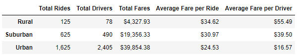
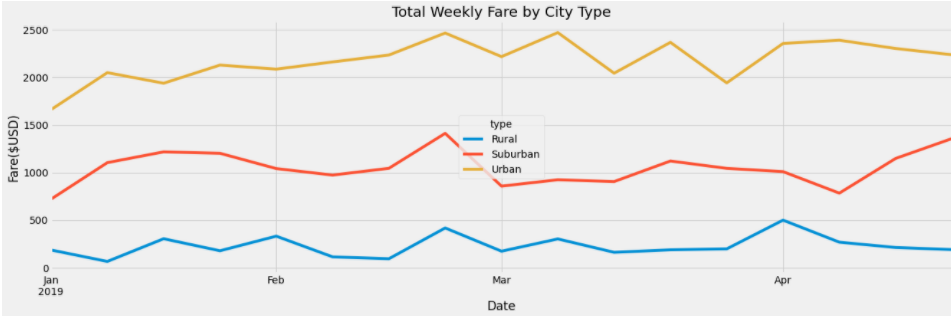

# PyBer Analysis Project

## PyBer Analysis - Overview:

The purpose of the following analysis is to:
- create a summary DataFrame of the ride-sharing data by city type, 
- create a multiple-line graph that shows the total weekly fares for each city type, and
- summarize how the data differs by city type and how those differences can be used by decision-makers at PyBer.

## PyBer Analysis - Results and Analysis:

### Ride-Sharing Data per City Type:

  The table below displays ride-sharing data per city type.

  

  - Urban:  As expected with Ride-sharing data, the urban areas have higher numbers in the total rides, total drivers, and total fares categories, likely due to population and demand.  Also, as expected, the average fare per ride, and average fare per driver is the lowest of the three city types which could be due to more competition, shorter distances traveled, etc.

  - Suburban: Suburban cities fall in the middle of urban and rural cities when it comes to all categories as expected.

  - Rural:  Rural cities have the lowest numbers when it comes to total rides, total drivers, and total fares likley due to population and demand, but the highest when it comes to average fare per ride and average fare per driver likely due to less compettion, fewer drivers, and longer distances traveled.

### Total Weekly Fare by City Type:

The following chart shows the weekly fares by city type between January and April 2019.  All city types' fares increase around 2/24/19, and the city fares have several peaks during March.  There's also a very significant increase in fares at the beginning of April (4/7/19) for rural cities.

## PyBer Analysis - Business Recommendations:

- The fares in urban areas made up 63% of total fares for the time period analyzed.  Urban areas seem to have the most demand (highest total fares and total rides) so it's recommended to continue to focus company resources on urban cities.
- 30% of the total fares were in suburban areas.  There is still a large concetration of people in these areas so maybe market more to drivers which could create more compettion and possibly lower the fares, might be an incentive to get more riders.
- In order to increase profit in the suburban and rural areas, it may be worth marketing or providing incentives for riders during certain high profit travel dates (like spring break) or for special events; more data might be needed to complete this analysis, but in and around 2/24 and 4/7 seem to be big days in those city types.
- 
